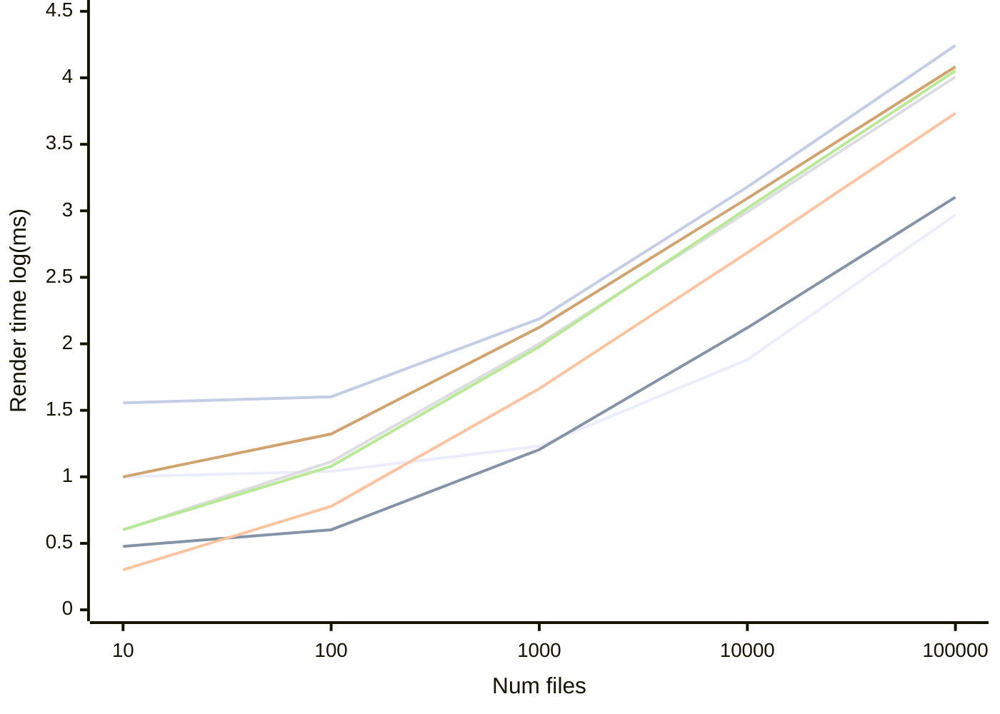

# File Explorers

This directory contains benchmarking and profiling harnesses for popular file explorers.

## Results

<!-- SIGNATURE -->

Last run on `2024-11-21` with `./generate_graph.py` \
Platform: `macOS-15.1.1-arm64-arm-64bit` \
Neovim:
```
NVIM v0.10.2
Build type: Release
LuaJIT 2.1.1727870382
```

<!-- /SIGNATURE -->

<!-- GRAPH -->



 oil.nvim  vim-dirvish  lir.nvim  mini.files  nvim-tree.lua  netrw  neo-tree.nvim

<!-- /GRAPH -->

<!-- TABLE -->

| Plugin        | 10 files | 100 files | 1,000 files | 10,000 files | 100,000 files |
| ------------- | -------- | --------- | ----------- | ------------ | ------------- |
| oil.nvim      | 10ms     | 11ms      | 17ms        | 76ms         | 933ms         |
| vim-dirvish   | 3ms      | 4ms       | 16ms        | 132ms        | 1,267ms       |
| lir.nvim      | 2ms      | 6ms       | 46ms        | 485ms        | 5,414ms       |
| mini.files    | 4ms      | 13ms      | 100ms       | 982ms        | 10,163ms      |
| nvim-tree.lua | 4ms      | 12ms      | 95ms        | 1,045ms      | 11,305ms      |
| netrw         | 10ms     | 21ms      | 133ms       | 1,240ms      | 12,104ms      |
| neo-tree.nvim | 36ms     | 40ms      | 154ms       | 1,510ms      | 17,508ms      |

<!-- /TABLE -->

<!-- REFS -->

Versions tested:

- oil.nvim: `bf81e2a` (2024-11-21)
- vim-dirvish: `2ddd8ee` (2024-09-03)
- lir.nvim: `5b1a927` (2024-05-26)
- mini.files: `6714e73` (2024-11-18)
- nvim-tree.lua: `f7c65e1` (2024-11-18)
- neo-tree.nvim: `a77af2e` (2024-09-16)

<!-- /REFS -->

## Commands

Benchmark a plugin

```bash
./run.sh benchmark oil
```

Get a LuaJIT profile of a plugin

```bash
./run.sh jit_profile oil
```

Get a Chrome trace profile of a plugin

```bash
./run.sh flame_profile oil
```
